# **Velocity Draft**

## _Game Design Document_

---

##### **@2026 ITARI Games Studio — Todos los derechos reservados**
##### Aixa Elenka Mendoza Filisola | A01782727 · Oscar Miguel Lara Elizondo | A01781855 · José Emilio Lara Posada | A01782838

---

## _Index_

1. [Game Design](#game-design)
    1. [Summary](#summary)
    2. [Gameplay](#gameplay)
    3. [Mindset](#mindset)
2. [Technical](#technical)
    1. [Screens](#screens)
    2. [Controls](#controls)
    3. [Mechanics](#mechanics)
3. [Level Design](#level-design)
    1. [Themes](#themes)
    2. [Game Flow](#game-flow)
4. [Development](#development)
    1. [Abstract Classes / Components](#abstract-classes--components)
    2. [Derived Classes / Component Compositions](#derived-classes--component-compositions)
    3. [Technical Overview](#technical-overview)
    4. [Game Physics](#game-physics)
    5. [Database Structure](#database-structure)
5. [Graphics](#graphics)
    1. [Style Attributes](#style-attributes)
    2. [Graphics Needed](#graphics-needed)
6. [Sounds / Music](#sounds--music)
    1. [Style Attributes](#style-attributes-1)
    2. [Sounds Needed](#sounds-needed)
    3. [Music Needed](#music-needed)
7. [Schedule](#schedule)

---

## _Game Design_

---

### **Summary**

Velocity Draft is a 2.5D roguelike racing game where strategy matters as much as speed. After your manager and pit crew abandoned you before the season began, you're left with a struggling car and something to prove. Build a deck to upgrade your car and obtain power-up cards, outsmart rival racers, and survive one demo race and 6 high-stakes races to become champion. With permadeath, randomized upgrades, and tough decisions every race, no championship run is ever the same.

### **Gameplay**

The goal is to complete a series of races in a continuous "run" format, finishing each race in the **top 3** while keeping the health bar from reaching 0 or empty. Players do not choose a class — instead, they build their driving style through a deck-building system, selecting one card from four randomized options offered after each race. Cards range from permanent performance upgrades (Passives) to limited-use weapons (Offensive) and healing tools (Repair).

As the player progresses through the races/levels, the difficulty scales: more complex layouts and more agressive/competitive CPU rivals. 

Finishing outside the 3 first places triggers a re-run of the race, giving the player an oportunity to retry the same race instead of triggering perma death. If the player loses their life they are sent to the start of the game, simulating what would happen if the car of a pilot broke and they had to wait for next season to compete. The player's life decreases with collisions and certain cards triggering permadeath.

### **Mindset**

The goal is to provoke a constant state of risk vs. reward tension. Unlike a casual racing game, every decision — which card to pick, when to use an offensive item, whether to push for position or play defensively — carries real consequences thanks to permadeath. Players should feel the adrenaline of survival combined with the satisfaction of a well-executed strategic play.

### **LOGO**

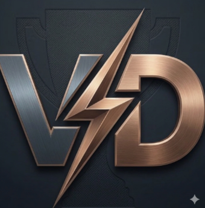

---

## _Technical_

---

### **Screens**

1. **Title Screen**
   - START → New run
   - OPTIONS → connects to the options/pause menu

    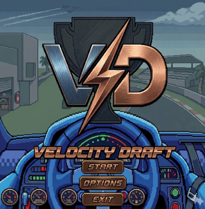

2. **Options / Pause Menu** *(doubles as pause screen)*
   - Sliders: Sound (SFX volume), Music, Brightness
   - SAVE & EXIT → returns to start screen
   - BACK → returns to game
  
   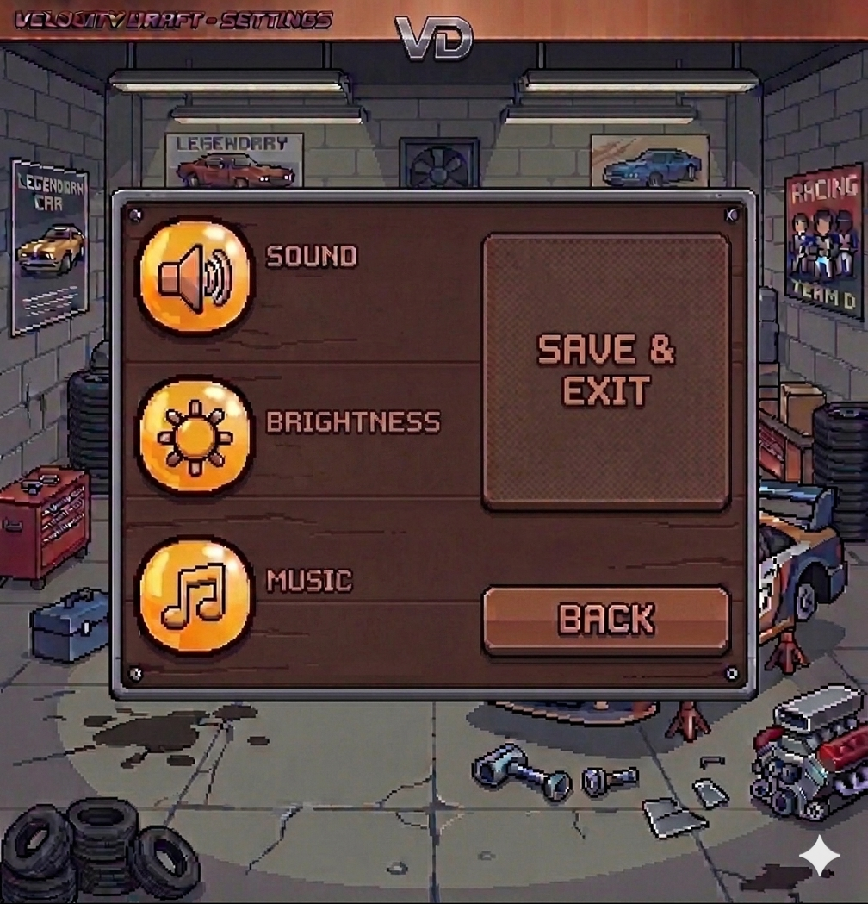

3. **Card Selection Screen**
   - Shown after each win or re-run or loss (Level 1 onward)
   - Displays 4 randomly drawn cards from the card pool
   - Player selects 1 with mouse/Enter

   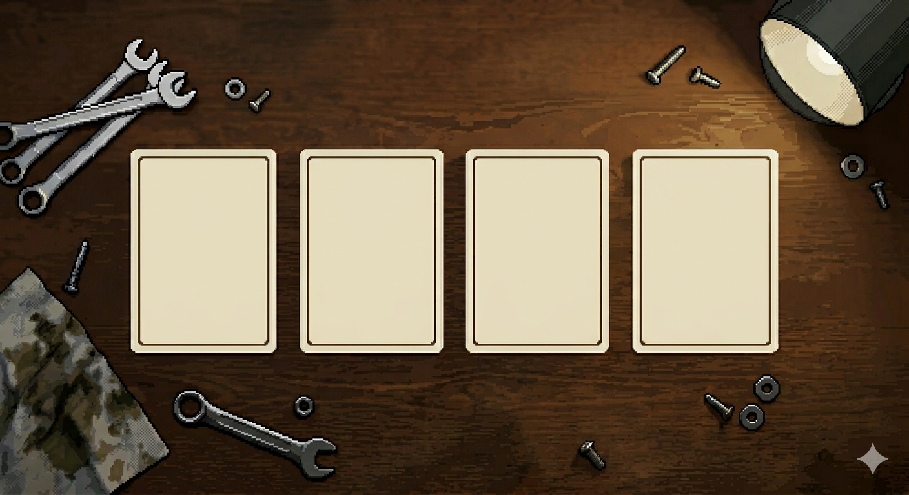

4. **Storytelling / Cutscenes**
   - Intro cutscene explaining the driver's backstory
   - Simplistic pixel art style, text-driven, advanced with click

   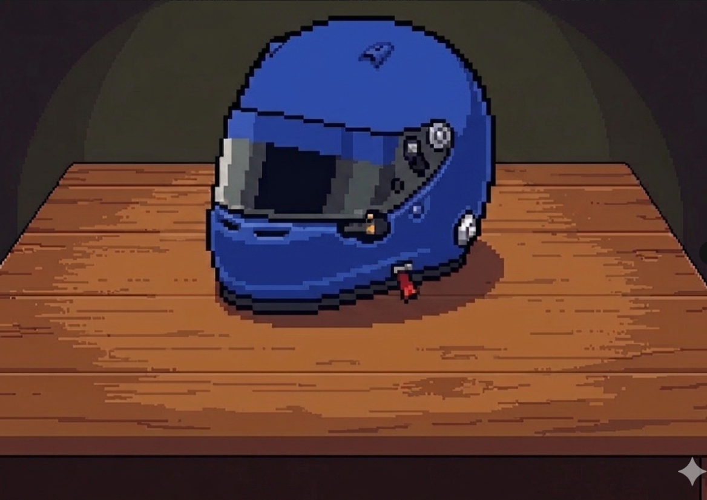

5. **Gameplay Screen**
   - Main 2.5D race view (Mode 7 floor + sprite karts)
   - Question mark -> instructions and card descriptions display
   - space key → Pause Menu
   - HUD: health bar, race position, active cards/race cards (up to 3 offensive slots),
     passive cards/upgrades (up to 4 passive slots), minimap with the location in the
     racemap of the player (dot followed by yellow mark) and rival location (other dots. 
  
   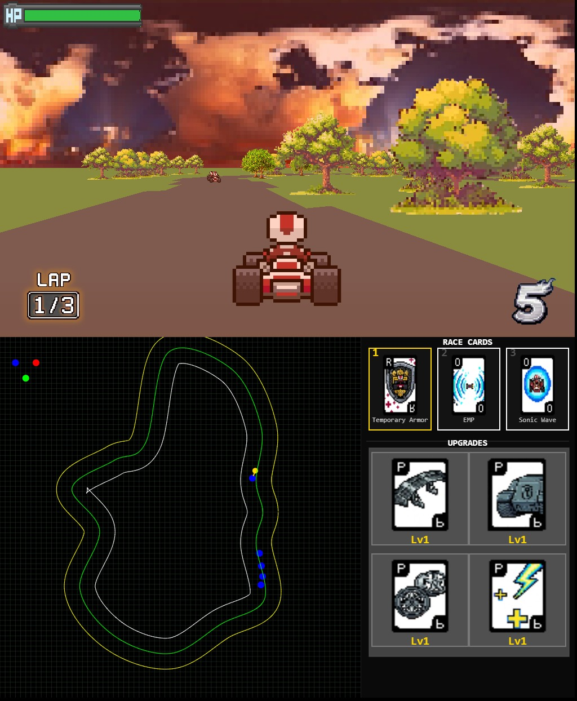

6. **Level transitioning screens**
    - Simplistic pixel art style, text-driven, advanced with click
    - Variations include different screens for each race announcing the number
      or title of said race. For the mock/practice race it also includes instructions on
      how to play
      
   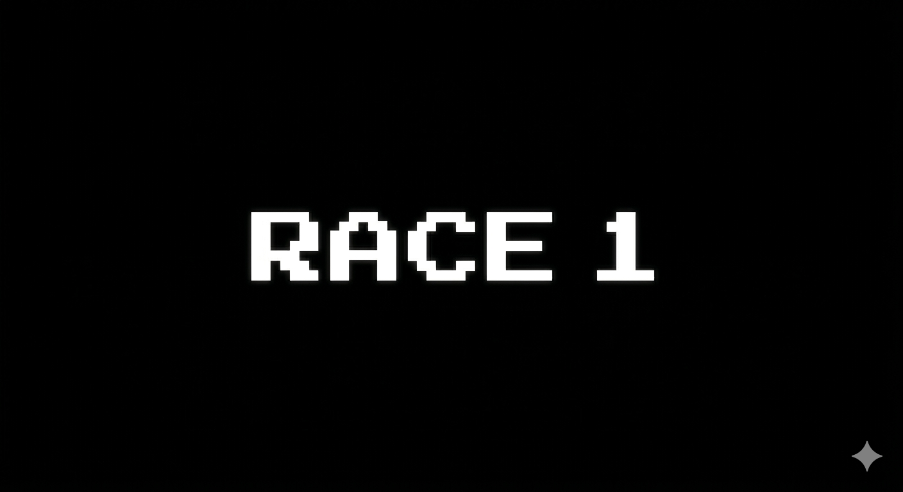

7. **Results Screen Positive**
   - WIN variant: trophy + flag
   - Triggers Card Selection and next race

   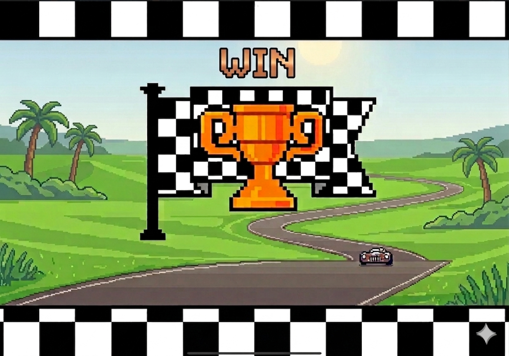

8. **Results Screen Positive Championship**
   - WIN variant: trophy + flag + "CHAMPIONSHIP" title
   - Triggers credit screen
     
   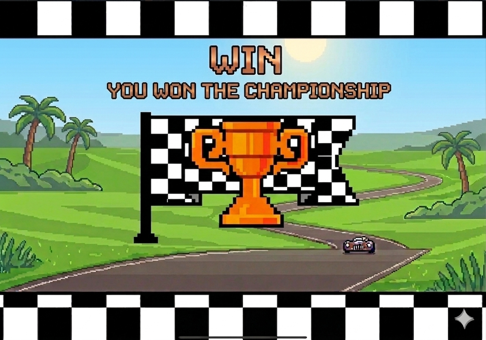
   
9. **Results Screen Negative**
   - LOSS variant: trophy + sad player icon
   - Triggers Card Selection and re-run of the race

   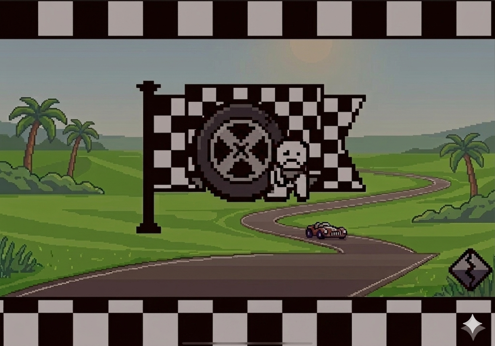

10. **Credits Screen**
   - Team names
   - Background music playing
   - BACK TO MAIN MENU button

   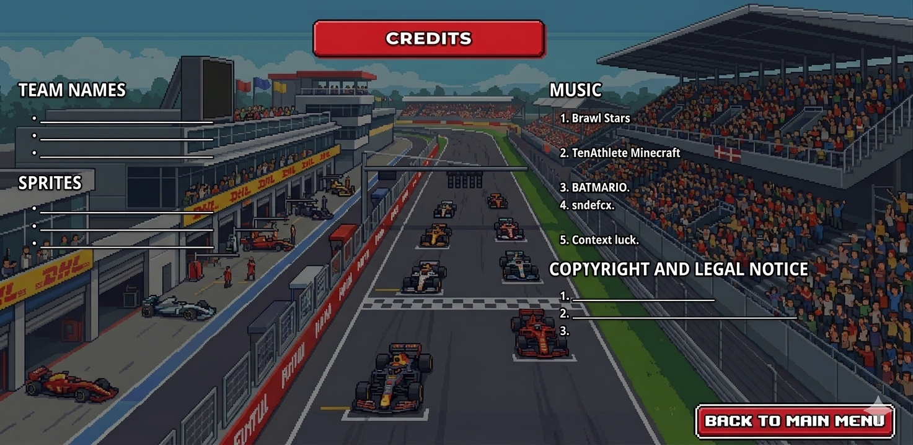

---

### **Controls**

| Key       | Action                                      |
|-----------|---------------------------------------------|
| W / ↑     | Accelerate                                  |
| S / ↓     | Brake / Reverse (when stopped)              |
| A / ←     | Turn left                                   |
| D / →     | Turn right                                  |
| O         | Select offensive/repair card                |
| P         | Use selected offensive/repair card          |
| SPACE     | Pause game                                  |
|  Click    | Advance cutscene                            |
| Mouse     | Navigate menus, select cards in menu        |
| Enter     | Confirm card selection in menu              |

---

### **Mechanics**

#### Health Bar
A single persistent health bar replaces the traditional lives system. Damage is received from crashes, enemy collisions, and effect hits. At 0 HP the car explodes and the entire run ends (permadeath).

#### Race Classification
Finish in the **top 3** to advance. Finishing 4th or lower ends the run immediately, regardless of HP remaining, and forces the player to re-run the race.

#### Card System
At run start, the full card pool is available. After each race, 4 random cards are drawn and the player picks 1. Every race the rivals recieve a random card.
Card categories:

**Passives (Permanent upgrades — no button slot)**
Passive cards work as upgrades for the car. They appear at the bottom of the screen and can only be selected by the player before the race. 
- **Racing Transmission** — increases base acceleration
- **Heavy Chassis** — reduces damage and impulse from kart collisions; multiplies opponent's impulse
- **Sport Tires** — increases aceleration.
- **Aerodynamic Spoiler** — increases base top speed

**Offensive (Active, key-triggered, limited durability 1–2 races, max 3 in deck)**
Offensive cards work as powers/powerup's during gameplay. They appear untop of the passive cards, the player chooses when (during the race) to implement them.
- **Tire Shredder** — causes rival to lose control and drop top speed for 3–5 sec
- **EMP** — shockwave that disables nearby enemies' attacks and pushes them outward
- **Grappler Hook** — latches onto the car ahead; steals 15% of their current speed
- **Sonic Wave** — forward/backward sound blast that damages and pushes enemies sideways

**Repair (Active, between or during races)**
The repair cards form the normal deck with the offensive.
- **Repair Bot** — recover 30% HP immediately
- **Temporary Armor** — adds a shield that absorbs the next hit without damaging base HP

#### AI Rival Behaviors
- **The Fast (Leader)** — prioritizes position, avoids fights, dangerous when approached
- **The Aggressive** — targets the player with collisions and traps; forces repair card usage
- **The Strategic** — forces dodging by blocking the player from any position.
- **The Provocative** — focuses on advancing to first position but when detecting the player prioritizes blocking from the front to slow down the player or cause health damage.

#### Obstacles & Environment
- **Off-road terrain** — reduces speed gradually until it reaches 0, disables offensive cards

---

## _Level Design_

---

### **Themes**

The visual theme is retro arcade racing: vivid green grass, blue sky, trees and classic track-side elements. Each race uses a different time-of-day background (sky panorama) with its own atmosphere:

| Time | Atmosphere | Sky |
|----------|-------------------------------|-------------------------|
|1.Sunrise| Quiet, soft, fresh start | Orange/golden horizon |
| 2.Midday| Bright, warm, non-threatening | Blue sky with clouds, slight orange gradient|
| 3.Sunset| Warm, reflective, melancholic | Orange/dark blue gradient |
1.

2.

3.

Track complexity increases with each level: more waypoints (turns), additional laps, and tighter layouts.

---

### **Game Flow**

**Title Screen** → Story Cutscene (driver backstory, team quit, fight for championship alone)

**Race Introduction screen** → Specific screen for pactice race that shows basic instructions.

**Practice race**
- 1 CPU
- Teaches: acceleration, braking, turning
- Unlocks the full card pool on completion

**Results screen**
-Variation for winning or losing

**Card Selection** → First exposure; shows 4 randomized cards for the player to choose from.

**Race Introduction screen** → Only includes the title of the level

**Level 2 — First Real Race**
-Initial number of laps
- 4 CPUs, sunrise/midday/sunset conditions
- CPUs receive hidden upgrades (offensive, passive, or repair)
- Must finish top 3 to continue
- Permadeath active from here on (run restarts as "another season") if 0 health reached
- Re-run triggered if not three first places reached (retains passive/car upgrades)

**Results screen**

**Card Selection**

**Race Introduction screen** 

**Level 3** 
— Similar to L2
-number of laps increases

**Results screen**

**Card Selection**

**Race Introduction screen** 

**Level 4** 
— Similar to L3, same number of laps as L3
- parameters for CPUs are modified/upgraded

**Results screen**

**Card Selection**

**Race Introduction screen** 

**Level 5** 
— 4 CPUs
— Similar to L3, same number of laps as L3
-parameters for CPUs are modified/upgraded

**Results screen**

**Card Selection**

**Race Introduction screen** 

**Level 6** 
— 4 CPUs
— Similar to L3, same number of laps as L3
-parameters for CPUs are modified/upgraded
-pre-championship race

**Results screen**

**Card Selection**

**Race Introduction screen** → Specific variation for championship race

**Level 7 — Championship Race**
— Similar to L3, same number of laps as L3
- All mechanics active, highest CPU difficulty
  
**Results screen**
  -In case of winning specific variation for championship
  
**Credit screen**
-Includes the name of the team members

---

## _Development_

---

### **Abstract Classes / Components**

| Class | Responsibility |
|----------------|----------------|
| **GameLoop** | Core execution cycle via `requestAnimationFrame()`. Manages update/render pipeline. All components initialized here. |
| **Input** | Keyboard state manager. Listens to `keydown`/`keyup` events, exposes `isPressed(key)`. |
| **Camera** | Player's POV. Stores `posX`, `posY`, `dirX`, `dirY`, `planeX`, `planeY`, `posZ`. Follows PlayerKart. |
| **Track** | Procedurally generated circuit. Handles waypoint generation, Catmull-Rom spline, edge normals, grid rasterization, spawn position, and checkpoint generation. |
| **Kart** | Base entity for all vehicles. Shared state: position, direction vector, speed, topSpeed, acceleration, grip, health. |

---

### **Derived Classes / Component Compositions**

| Class | Description |
|-------|-------------|
| **FloorCaster** | Receives Camera + Track each frame. Mode 7-style floor projection per scanline, samples Track grid for asphalt/grass color. Writes to Canvas pixel buffer. |
| **SpriteRenderer** | Receives Camera + list of Kart/Projectile objects. Computes screen position and scale per sprite (billboard). Painter's Algorithm sort. |
| **Minimap** | Renders top-down overview on secondary canvas. Draws track edges, kart positions as colored dots. |
| **HUDRenderer** | Reads PlayerKart + CardSystem state. Renders health bar, lap, race position, active offensive slots on main canvas. |
| **PlayerKart** | Extends Kart. Reads Input each frame for acceleration/braking/steering. Terrain modifiers applied from Track grid. Stats modified by CardSystem passives. |
| **CPUKart** | Extends Kart. Controlled by AIController (no Input). Follows spline waypoints. Behavior type assigned at race start. |
| **AIController** | Manages all CPUKart instances. Computes steering/acceleration per behavior type each frame. Uses spline for pathfinding, PlayerKart position for offensive decisions. |
| **CardSystem** | Manages deck across races. Stores card pool, active passives applied to PlayerKart, 4-slot offensive inventory. Presents 4 random cards between races. |
| **RaceManager** | Tracks lap counts, race positions, finish conditions. Determines podium result. Triggers CardSystem post-race. Manages roguelike run-end conditions (outside top 3 or HP = 0). |
| **CardSelectionScreen** | Rendered between races. Displays 3 available cards, handles selection input, returns control to GameLoop. |
| **PauseMenuScreen** | Hadles the modification of settings. |
| **TireShredder / EMP / GrapplerHook / SonicWave** | Implement specific offensive behaviors per card. |

---

### **Technical Overview**

#### 2.5D Visual Style
The game uses a retro-inspired pseudo-3d visual style similar to classic arcade racing games. Tracks are rendered using perspective-based floor projection techniques to create the illusion of depth, while karts and projectiles are displayed as scaled sprites that grow or shrink depending on distance from the camera. 

The upper half of the screen displays the sky backgrounds, which change according to the current level theme and in-game time of day.

#### Track Generation
Tracks are procedurally generated using curved waypoint paths to create smooth racing circuits. Each track includes:
1.Road boundaries
2.Checkpoints
3.Spawn positions
4.Off-road terrain areas.
If the player drives off to these areas it will lose all speed.

Track complexity increases throughout the game by introducing tighter turns, additional laps. 

---

### **Game Physics**

#### Kart Movement

#### Steering / Rotation

Camera plane rotates identically to keep FOV consistent.

#### Terrain (sampled each frame from grid)

| Terrain | Gameplay Effect|
|----------|-------------|
| Asphalt| Normal speed and handling. |
| Grass| Reduces speed and traction, making turning more difficult. |

#### Kart vs Track Collision

- Off-grid boundary → velocity = 0, kart pushed back
- Off-track (grass) → terrain penalties apply

#### Kart vs Kart Collision (Circle Collision)

On collision: both receive impulse away from each other. The Aggressive CPU uses this intentionally. Heavy Chassis card reduces damage received and modifies impulse magnitudes.

#### Card Stat Modifiers (applied at selection time, stackable)

| Card | Effect |
|------|--------|
| Racing Transmission | Improves vehicle acceleration. |
| Heavy Chassis |Reduces collision damage and increases resistance to impacts |
| Sport Tires | Improves acceleration. |
| Aerodynamic Spoiler | Increases maximum speed |

---

### **Database Structure**

Purpose: The database system will be focused on maintaining player progression persistence and the creation of statistics for the balancing of the game and player experience enhancement.
For the players a leader board will be able. The places in this board will be determined based on the fastest time they obtain in a race.
For the admins the statistics will be more "balancing the dynamics" focused. 
These include:

-Card impact
Ilustartes the relation between activated and chosen cards with the podium rate.

-Daily race quality
Which ilustrates how many races took place in a day and how many players reached podium in such races.

-Race level difficulty
Which measures how many wins occur in a race and provides a comparison with how many players started those races.

These statistics give admins an idea of how the player are executing their strategies (for example if cards really make a difference in the races and by consequence the players do activate them (card impact)). 

The database stores most information of the game including the player's information (account), the cards information, the rivals information and the game's.

---

## _Graphics_

---

### **Style Attributes**

Pixel art, retro arcade racing aesthetic. Vivid but limited palette to avoid visual overload. All characters and enemies are outlined in black for contrast against the background.

Sprite resolution: **64×64 pixels** per kart and card. Health bar visible at all times during races — flashes red when HP hits 0 before the explosion effect triggers.

**Color palettes :**

The color for the CPU rivals is determined by their personality. Each has a distinct main color:
1. The blue rival is the leader (fast) personality.
2. The green is the agressive personality.
3. The grey rival has the strategic personality. 
4. The yellow rival is the provocative personality.
They all have as accent colors white, and grey. With the grey rival having light purple details. And the yellow rival having orange shadows to add contrast.

Player kart: The car uses red as it's main color with grey and white details.

### **Graphics Needed**

**Karts (Player + 4 CPU variants)**

For each kart: back view with their respective palletes

CPU variants:

(The low resolution is because of the sprites size)

**Cards (10 total)**
- Front face: unique illustration + category letter (P / O / R) + ability identifier
  
Concept art:

 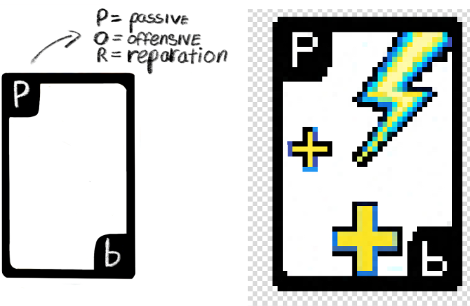

Implemented design:

1.Passive cards (aerodynamic spoiler, heavy chasis, racing transmition, sport tires)

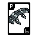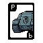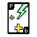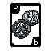

2. Offensive cards (EMP, grapplerhook, sonicwave, tire shredder)
   
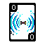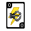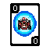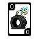

3. Repair cards (repair bot, temporary armour)

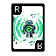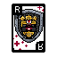

**UI Elements**
- Health bar
- Race position indicator
- Card HUD slots (4 offensive)
- Minimap overlay frame

**Backgrounds / Skyboxes**
- Sunrise, Midday, Sunset pixel art backgrounds

**Cutscene Art**
- Intro (helmet on table for background)
- Race introduction nd variants
- Credits and Title screens
- Win / Permadeath variants

---

## _Sounds / Music_

---

### **Style Attributes**

Sound effects should be punchy and arcade-style — enough to confirm actions without overwhelming the race audio. Music is original, city pop / Japanese racing game aesthetic (Gran Turismo influence): upbeat, melodic, loop-friendly.

### **Sounds Needed**

| Sound | Reference |
|--------|-----------|
| Car Accelerating | [YouTube](https://www.youtube.com/watch?v=WWa441avBHs) |
| Car Decelerating | [YouTube](https://www.youtube.com/watch?v=veP_A5bQT4c) |
| Car Drifting (tire screech) | [YouTube](https://www.youtube.com/watch?v=iwJnfe69Glo) |
| Explosion | [YouTube](https://www.youtube.com/watch?v=HTXiJpCDiH4) |
| Car Crash | [YouTube](https://www.youtube.com/watch?v=uakY1LYZ3Vo) |
| UI Selection | [YouTube](https://www.youtube.com/watch?v=d9sQvn0pYts) |
| Race Start | [YouTube](https://www.youtube.com/watch?v=KOoCEIwswYg) |

### **Music Needed**

All tracks original, composed and recorded by the team.
1. Gold Medal Run
2. Midnight Pit Stop
3. Race
4. Velvet Tide.

| Track | Context |
|-------|---------|
| Gold Medal Run| Result screen positive (Win) |
| Midnight Pit Stop | Between-race card select screen |
| One final turn | Result screen negative (loss) |
| Race | During races |
| Velvet tide | Intro screens |
| Velvet tide | Credits |

Style: city pop / Japanese racing game aesthetic. Upbeat, melodic, loop-friendly.

---

## _Schedule_

---

### Sprint 1 — Documentation & Conceptualization ✅
- Finalization of GDD
- Initial UML / Entity-Relationship diagram sketch
- Creation of user stories (game + database)

### Sprint 2 — Core Engine ✅
- Base classes: `Kart`, `Track`, `Camera`
- Input system (keyboard/mouse)
- MySQL database setup and table creation

### Sprint 3 — Roguelite System & AI ← *Current*
- Implement `CardSystem` (passive upgrades + active abilities)
- Implement kart physics and track/kart collision
- Develop AI behavior for all 4 CPU types (`AIController`)

### Sprint 4 — Level Design & Content
- Race tracks with increasing complexity (more waypoints, laps)
- Weather system integration (rain/wind modifiers)
- HUD: health bar, race position, active card slots

### Sprint 5 — Assets, Sounds & Web Integration
- Music and SFX integration
- Finalize all 2.5D sprites and environment backgrounds
- HTML/JS/CSS web page development

### Sprint 6 — Testing, Bug Fixing & Delivery
- Intensive QA (errors, glitches, memory leaks, logic errors)
- AI difficulty + card power balancing
- Final documentation review and stable build delivery
